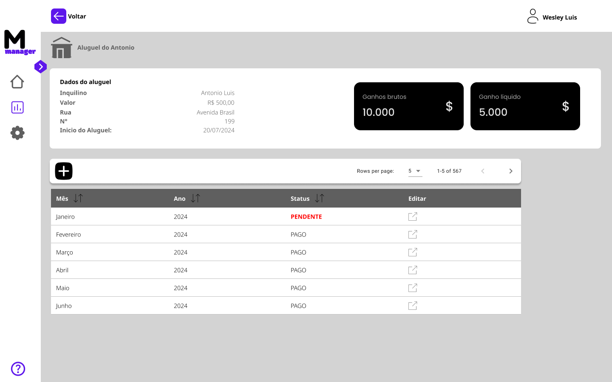
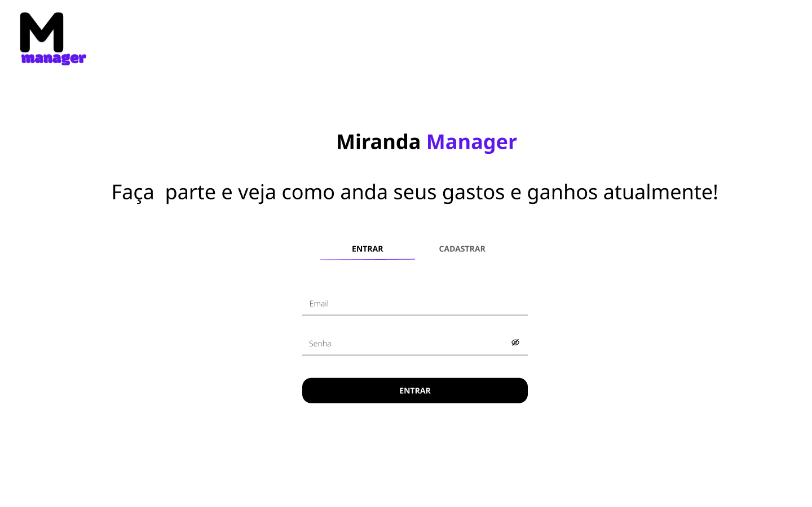
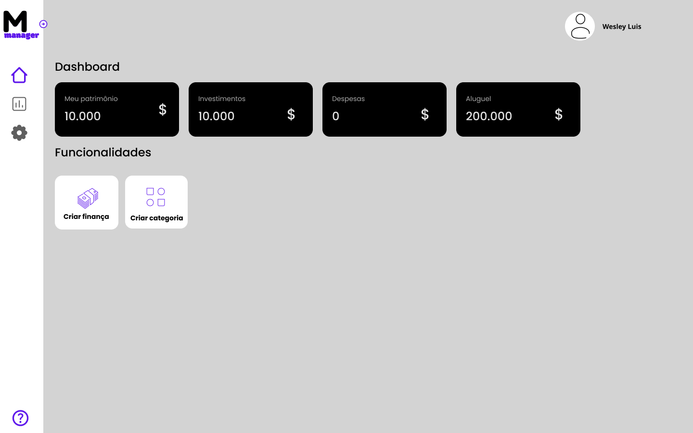

# Miranda Manager - Desafio
Esse desafio foi montando por mim mesmo para treinar e estudar as tecnologias: Node.js, React.js, Express.js, MongoDB e Docker.

> Instruções:
* Desenvolver interface utilizando Figma;
* Utilizar TypeScript;
* Desenvolver API REST utilizando Node.js;
* Criar collection no Insomnia;
* Dockerizar aplicação.
* Criar README com as instruções para executar o projeto.

> Contexto:

Deve ser desenvolvido um sistema para gerenciar os gastos ou ganhos do usuário por mês. Para desenvolver esse sistema, o usuário levantou as seguintes funcionalidades:
* Deve ser possível realizar login;
* Deve ser possível registrar novos ganhos/despesas;
* Cada finança, deve ter sua própria página com todos seus metadados;


## Design da Aplicação

O design da aplicação foi criado utilizando Figma. Você pode visualizar o projeto clicando no link abaixo:

[Visite o Design no Figma](https://www.figma.com/design/b1AuHS9YSnjnZwpmScch5E/Miranda-Manager?node-id=0-1&t=g863gzPdQAp355vv-1)

### Imagens do Design

Aqui estão algumas imagens do design da aplicação:

#### Página de Finança

#### Tela Inicial

#### Página de Login



## Tecnologias Utilizadas

- **Frontend:** React.js, JavaScript, React Hook Form, React Icons,HTML, CSS
- **Backend:** Node.js, Express.js, TypeScript, TypeORM, Mongoose, JWT, tsyringe
- **Banco de Dados:** MongoDB
- **Docker:** Para containerização da aplicação

## Instruções de Execução

### Pré-requisitos

Certifique-se de ter as seguintes ferramentas instaladas:

- [Docker](https://www.docker.com/)
- [Docker Compose](https://docs.docker.com/compose/)

### Configuração do Ambiente

1. **Clone o repositório:**

   ```bash
   git clone https://github.com/wesleydrc/miranda-manager.git
   cd miranda-manager

2. **Configure o arquivo .env do backend:**
	
	* Crie o arquivo ".env" em "./backend"

	Veja um exemplo de como deve ser o arquivo .env:
	
	```
	PORT=5000
	HOST=0.0.0.0
	APP_SECRET=secret123

	# MySQL Database
	MYSQL_PROVIDER=
	MYSQL_HOST=
	MYSQL_PORT=
	MYSQL_USERNAME=
	MYSQL_PASSWORD=
	MYSQL_DATABASE_URL=

	# MONGO DATABASE
	MONGO_PROVIDER=mongodb
	MONGO_HOST=localhost
	MONGO_USERNAME=root
	MONGO_PASSWORD=example
	MONGO_PORT=27017
	MONGO_URI=mongodb://database:27017
	MONGO_DATABASE_NAME=miranda_manager_database

	# MONGO EXPRESS
	ME_BASIC_AUTH_USERNAME=admin
	ME_BASIC_AUTH_PASSWORD=admin
	ME_PORT=8081
	```

3. **Executar aplicação:**
	``` 
	miranda-manager/app
	├── frontend/
	│   └── docker-compose.yml
	│   └── ...
	├── backend/
	│   └── docker-compose.yml
	│   └── ...
	```

	No diretório raiz do repositório("caminho-ate-o-repositorio/miranda-manager"), você executará os seguintes comandos para executar os compose files.


	```bash
	docker compose -f ./app/frontend/docker-compose.yml up -d --build
	```

	```bash
	docker compose -f ./app/backend/docker-compose.yml up -d --build
	```

3. **Acesse a aplicação:**

* Frontend: http://localhost:3000

* Mongo Express: http://localhost:8081

* Backend: http://localhost:5000

## Contribuição
Sinta-se à vontade para contribuir para este projeto. Envie um pull request ou abra uma issue para discutir melhorias ou correções.